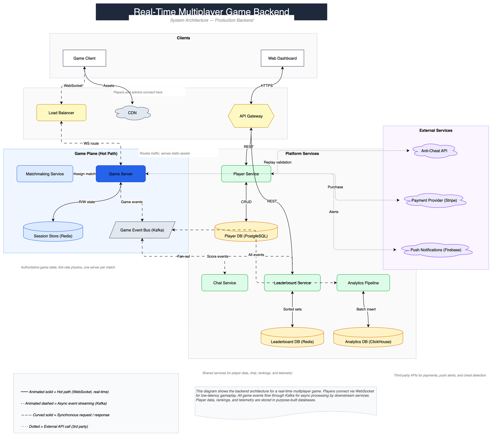

# fcp-drawio

MCP server for creating and editing draw.io diagrams through intent-level commands.

## What It Does

fcp-drawio lets LLMs build architecture diagrams, flowcharts, and system maps by describing what they want -- not how to draw it. The LLM sends high-level operations like `add svc AuthService theme:blue` and `connect AuthService -> UserDB`, and fcp-drawio renders them into fully styled draw.io XML with automatic layout via ELK. Built on the [FCP](https://github.com/aetherwing-io/fcp) framework.

<p align="center">
  
  <br>
  <em>Multiplayer game backend — 20 nodes, 5 swim lanes, auto-layout (<a href="https://app.diagrams.net/#Uhttps%3A%2F%2Fraw.githubusercontent.com%2Faetherwing-io%2Ffcp-drawio%2Fmain%2Fdocs%2Fexamples%2Fmultiplayer-game-backend.drawio">open in draw.io</a>)</em>
</p>

## Quick Example

```
drawio([
  'add svc AuthService theme:blue',
  'add db UserDB theme:green near:AuthService dir:right',
  'connect AuthService -> UserDB label:queries',
])
```

Response:

```
+svc AuthService @(200,200 140x60) blue
+db UserDB @(400,200 120x80) green
~AuthService->UserDB "queries" solid
digest: 3s 1e 0g
```

This produces a draw.io diagram with a blue rounded-rectangle service node, a green database cylinder, and a labeled edge between them -- all positioned automatically.

### Available MCP Tools

| Tool | Purpose |
|------|---------|
| `drawio(ops)` | Batch mutations -- add shapes, connect, style, group, layout |
| `drawio_query(q)` | Inspect the diagram -- map, list, describe, connections, find |
| `drawio_session(action)` | Lifecycle -- new, open, save, checkpoint, undo, redo |
| `drawio_help()` | Full reference card |

### Component Library

| Type | Shape | Use For |
|------|-------|---------|
| `svc` | Rounded rect | Services, components |
| `db` | Cylinder | Databases, storage |
| `api` | Hexagon | APIs, gateways |
| `queue` | Parallelogram | Queues, streams |
| `cloud` | Cloud | External services |
| `actor` | Person | Users, personas |
| `doc` | Document | Files, reports |
| `box` | Rectangle | Generic |
| `decision` | Diamond | Decisions, conditions |
| `circle` | Ellipse | States, events |
| `process` | Double-bordered rect | Predefined processes |
| `triangle` | Triangle | Warnings, deltas |

### Themes

Apply color themes to any shape: `blue`, `green`, `red`, `orange`, `purple`, `yellow`, `gray`, `dark`.

## Installation

Requires Node >= 22.

```bash
npm install @aetherwing/fcp-drawio
```

### MCP Client Configuration

```json
{
  "mcpServers": {
    "drawio": {
      "command": "node",
      "args": ["node_modules/@aetherwing/fcp-drawio/dist/index.js"]
    }
  }
}
```

## Architecture

4-layer architecture:

```
MCP Server (Intent Layer)
  src/server/ -- Parses op strings, resolves refs, dispatches
        |
Semantic Model (Domain Brain)
  src/model/ -- In-memory entity graph, event sourcing
        |
Layout (ELK)
  Auto-layout via elkjs -- flow:TB, flow:LR, near/dir positioning
        |
Serialization (XML)
  src/serialization/ -- Semantic model <-> mxGraphModel XML
```

Supporting modules:

- `src/parser/` -- Operation string parser
- `src/lib/` -- Component library, themes, stencils, draw.io CLI integration

See [`docs/examples/`](docs/examples/) for example diagrams (including the [multiplayer game backend](docs/examples/multiplayer-game-backend.drawio)) and [`docs/`](docs/) for design documents.

## Development

```bash
npm install
npm run build     # tsc
npm test          # vitest, 465 tests
npm run test:watch
npm run dev       # tsc --watch
```

## License

MIT

